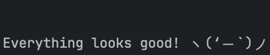
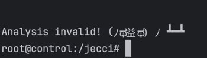

# jepsen.Big-O

A Clojure library designed to perform linearizable test for Big-O solutions.

## Usage

### To run test suite

```agsl
cd docker
bash bin/up  --dev -d
bash bin/console
// Use this command for quick feedback
lein run test --concurrency 10 --test-limit 5
// Use this command only when the final testing in needed
lein run test --concurrency 100 --test-limit 60 --test-count 10
```

### To check the run histories

* you can either check `/store` folder for test-run related logs and details.
  * Logs from the database will also be accessible under nodes folder(n1, n2, n3)
* You can serve the results as a website and access the details through UI
```agsl
  cd docker
  bash bin/console
  lein run serve
  // Open a new terminal
  cd docker
  bash bin/web
          
```

### To stop/remove the containers
```agsl
cd docker
bash bin/stop-all.sh
// Or.
bash bin/remove-all.sh
```

### To run your solution against the test suite

* I have compiled my mock solution and added the binary to the nodes docker (docker/node/Dockerfile)
* Update utils.clj with your binary name.
* If there are any command line arguments needed, those can be added here (bigo/db.clj:22)


**Test suite would print the below statement when the test succeed**



**Example for failure case:**



Recording for explanation on the test suite here: https://drive.google.com/file/d/1yLwv4VMcahrLMzZhZaI2fHRRL3zDkW9Q/view


## License

Copyright © 2023 FIXME

This program and the accompanying materials are made available under the
terms of the Eclipse Public License 2.0 which is available at
http://www.eclipse.org/legal/epl-2.0.

This Source Code may also be made available under the following Secondary
Licenses when the conditions for such availability set forth in the Eclipse
Public License, v. 2.0 are satisfied: GNU General Public License as published by
the Free Software Foundation, either version 2 of the License, or (at your
option) any later version, with the GNU Classpath Exception which is available
at https://www.gnu.org/software/classpath/license.html.
